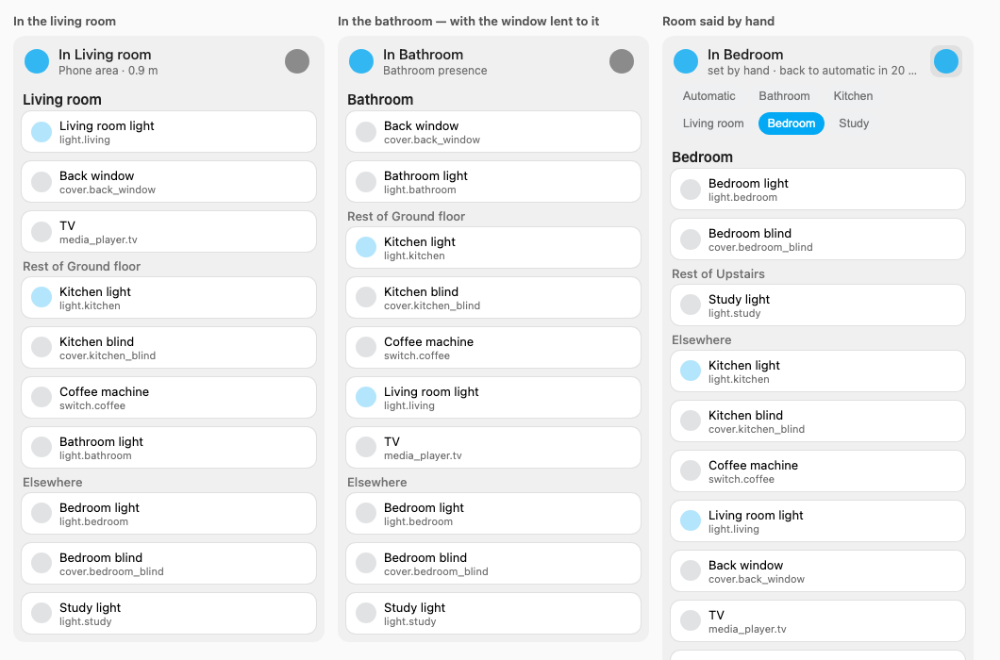

# Nearby Card

A Lovelace container that moves the cards for the room you are in to the top of the stack.

You give it cards, the way you would give them to `vertical-stack`. It reads the entity out of each one, asks Home Assistant's registry which area that entity belongs to, and reorders the stack: the room you are in first, then the rest of that floor, then everything else. Walk upstairs and the stack follows you.

Anything can go in it — tiles, mushroom cards, custom cards, whole stacks. It does not care what the card is, only which entity it points at.

It draws no background of its own: the cards inside keep theirs, and the result reads as a stack of cards rather than a box with cards in it. Headings are Home Assistant's own heading card, and the cards are edited with Home Assistant's own stack editor, the one behind Vertical stack — card search, previews, paste from clipboard, reordering, GUI and YAML.



<sub>Offline preview from `tools/preview.html`, on a made-up house: the rows inside are stand-ins for whatever cards you nest, and the grey frame stands in for the dashboard section, so that the grouping is what you look at.</sub>

## Why

A dashboard of twenty lights and blinds is a scrolling list where the three you actually want are never in the same place twice. Presence integrations already know roughly where you are; this card spends that knowledge on the only thing that matters at the moment you pull the phone out of your pocket — putting the right controls under your thumb.

## Install

### HACS

1. HACS → Dashboard → three dots → **Custom repositories**
2. Add `https://github.com/borile91/lovelace-nearby-card`, category **Dashboard**
3. Install, then reload the page

### Manually

Copy `nearby-card.js` into `config/www/` and add it as a dashboard resource:

```yaml
# Settings → Dashboards → three dots → Resources
url: /local/nearby-card.js
type: module
```

## Quick start

Add the card from the picker (**Nearby Card**), drop in a few cards, and point it at whatever already knows where you are:

```yaml
type: custom:nearby-card
presence:
  area_sensor:
    entity: sensor.phone_area        # Bermuda, ESPresense, your own template…
cards:
  - type: tile
    entity: light.kitchen
  - type: tile
    entity: cover.bedroom_blind
  - type: tile
    entity: switch.coffee
```

That is enough. Areas come from the entity registry, floors come from the areas — nothing to list twice.

## Presence

Two kinds of source, because one is rarely enough. `presence.priority` decides which is asked first; the first one with an answer wins.

### Area sensor

A single entity that reports which area you are in.

```yaml
presence:
  area_sensor:
    entity: sensor.phone_area
    area_attribute: area_id          # default; leave empty if the area is in the state
    floor_attribute: floor_id        # default
    distance_entity: sensor.phone_distance
    max_distance: 3.5
```

One sensor covers the whole house, which is the good news. The bad news is what it actually reports: **the area of the nearest receiver**, which is not the room you are standing in when that room has no receiver.

Measured in a real house with three BLE proxies: standing in the living room, where a proxy sits, the distance sensor read **0.9 m** and the area was right. Standing in a downstairs bathroom with no proxy and no sensors of any kind, the same integration confidently said *"living room"* — at **6.3 m**. The floor was right; the room was not.

That is what `max_distance` is for. Past it the room is dropped and only the floor is kept, and the card says so instead of pretending:

> On Ground floor — Room unclear: nearest receiver is 6.3 m away, in Living room

A wide answer that is true beats a precise one that is wrong. Leave `max_distance` out to always trust the room.

If your sensor puts the area in its **state** rather than an attribute, leave `area_attribute` empty: the state is matched against the registry by area id and by name.

### Per-room sensors

One binary sensor per room — mmWave, PIR, a plug that draws current, a `input_boolean` you flip yourself.

```yaml
presence:
  priority: [area_sensors, area_sensor]
  area_sensors:
    - area: bathroom
      entity: binary_sensor.bathroom_presence
    - area: study
      entity: binary_sensor.study_presence
      state: "on"                    # default
```

Exact, but only for the rooms you cover. When several are on at once — you walked through — the **most recently triggered** one wins.

### By hand

Rooms neither source can see stay unreachable. No amount of software invents a receiver that is not there, so the header has a crosshair button: tap it, pick the room. The choice lasts `presence.manual_minutes` (20 by default) and then goes back to automatic, so a choice made this morning does not still be lying to you tonight.

Set `header.allow_manual: false` to remove the button.

## Lending a card to a nearby room

A card belongs to the area of its entity. Sometimes that is not where you reach for it: a window registered in the living room can sit right by the bathroom door.

```yaml
nearby:
  - area: bathroom
    entities:
      - cover.back_window
```

When you are in the bathroom, that card joins the bathroom group. It stays in the living room group the rest of the time.

For a card that is in the wrong area entirely, pin it instead — `nearby_area` on the card itself:

```yaml
cards:
  - type: tile
    entity: light.hallway
    nearby_area: kitchen
```

## Options

| Option | Default | What it does |
| --- | --- | --- |
| `cards` | *(required)* | The cards to reorder. Any card type. |
| `presence.area_sensor` | – | Single entity reporting the current area. See above. |
| `presence.area_sensors` | `[]` | Per-room presence sensors: `area`, `entity`, `state`. |
| `presence.priority` | `[area_sensors, area_sensor]` | Which source is asked first. |
| `presence.manual_minutes` | `20` | How long a room picked by hand lasts. |
| `nearby` | `[]` | Cards lent to another room: `area`, `entities`. |
| `grouping` | `area_floor_rest` | See below. |
| `sort` | `config` | `config` keeps your order, `name` sorts alphabetically inside each group. |
| `group_icons` | `false` | Draw the area or floor icon beside each heading. |
| `header.position` | `top` | `top`, `bottom`, or `hidden`. |
| `header.allow_manual` | `true` | Show the crosshair button. |
| `labels` | – | Override any of the strings the card shows. |

### Grouping

| `grouping` | Groups |
| --- | --- |
| `area_floor_rest` *(default)* | The room you are in, the rest of that floor, everything else |
| `area_rest` | The room you are in, everything else |
| `floor` | One group per floor, the one you are on first |
| `none` | A single flat list, no headings |

`floor` is the one to pick when the house is more vertical than it is wide, or when presence is only good enough to tell the floors apart — which is often the case with a single area sensor and few receivers. Floors come in the order they are stacked (their `level` in Home Assistant), except the one you are on, which jumps to the top and is drawn as a title rather than a subtitle. Cards whose area has no floor land in a group of their own, named by the `no_floor` label.

When nothing knows where you are, any grouping other than `none` falls back to `floor`.

Headings are Home Assistant's own **heading card**, not something drawn here to look like one — the group you are in gets the `title` style, the others `subtitle`. So they match the headings already sitting in your dashboard, and they keep matching when Home Assistant changes them.

`group_icons: true` puts the icon beside each heading — the area's own icon, and the floor's. A floor with no icon of its own falls back to its storey number (`mdi:home-floor-0`, `-1`, …), the same way Home Assistant draws it elsewhere; an area with no icon gets `mdi:texture-box`, so it still looks like an area.

> A group named **Unassigned** at the bottom means those cards sit in an area that has no floor. Give the area a floor in **Settings → Areas** and it joins the rest.

### Labels

Every string can be replaced, which is also how you translate the card:

```yaml
labels:
  here: Qui
  rest_of_floor: "Resto del {floor}"
  elsewhere: Altrove
  away: Fuori casa
  in_room: "Sei in {area}"
  on_floor: "Sei al {floor}"
  room_unclear: "Stanza incerta: il ricevitore più vicino è a {distance}, in {area}"
  manual: "detto a mano · torna automatico fra {minutes} min"
```

Placeholders in braces are filled in: `{area}`, `{floor}`, `{distance}`, `{minutes}`.

## What it does not do

- **It does not locate you.** It reads whatever presence integration you already run. If that integration cannot tell two rooms apart, neither can this card — see `max_distance` above for how it degrades instead of guessing.
- **It does not create cards.** No auto-discovery by domain or area: you choose what goes in, so nothing appears on your dashboard because an integration decided to add an entity.
- **It does not group by anything but area and floor.** Those come from the registry, so fixing the grouping means fixing the registry, which is where it belongs.

## Development

`tools/preview.html` runs the card in a browser with no Home Assistant at all: a fake house of two floors and five areas, stubs for the components the card touches, and eight cases with pass/fail verdicts — including the two that are annoying to reproduce by hand, "the room sensor beats the area sensor" and "you are 6.3 m from the nearest receiver".

```sh
open tools/preview.html

# or headless, verdicts on stdout:
/Applications/Google\ Chrome.app/Contents/MacOS/Google\ Chrome \
  --headless=new --disable-gpu --allow-file-access-from-files \
  --virtual-time-budget=4000 --dump-dom tools/preview.html | grep -A12 RESULTS
```

It proves the grouping, the order and the presence logic. It cannot prove how the nested cards look — those are real Home Assistant components. Check that in Home Assistant.

No build step: `nearby-card.js` is plain JavaScript, served as it is.

## License

MIT — Copyright (c) 2026 Giacomo Borile
